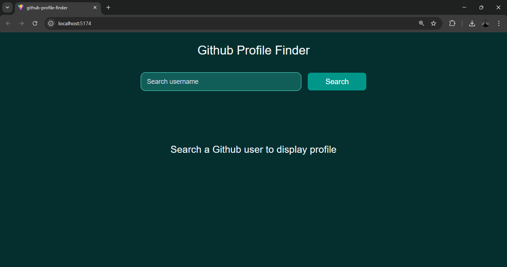
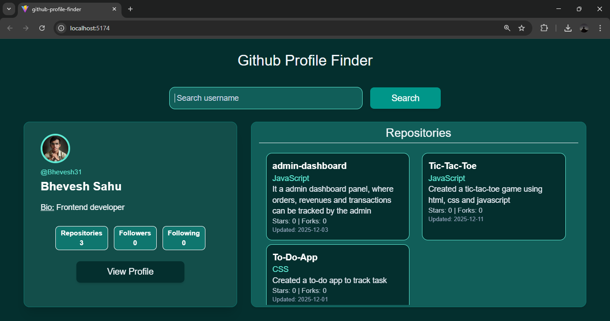

# 🔍 GitHub Profile Finder

A responsive web application that allows users to quickly search for any GitHub profile and view key details, including public repositories, follower count, bio, and more. The app also lists public repositories with **clickable titles**, linking directly to GitHub.

---

## 🚀 Features

- 🔎 **Search GitHub users** by username  
- 📁 **View public repositories** with clickable titles  
- 📱 **Fully responsive UI** (mobile-first design using default + `sm:` breakpoint)  
- 👤 Displays user details:  
  - Name & username  
  - Bio  
  - Followers, following & repos count  
  - Public repos    
- ⚡ Real-time data fetching from GitHub API  
- 🎨 Clean UI

---

## 🛠️ Tech Stack

- ⚛️ **React** — Component-based UI  
- 🎨 **Tailwind CSS** — Styling and responsive design  
- 🔗 **GitHub REST API** — User & repo data  
- 🚀 **JavaScript (ES6+)** — API fetching + logic  
- ⚡ **Vite** — Tooling & bundling 

---

## 📸 Screenshot

---

🌐 Live Demo

---

## ⚙️ How to Use

1. Enter any GitHub username in the search field  
2. Click **Search**  
3. The app will display:
   - Profile details  
   - List of public repositories  
4. Click any repo title to open it on GitHub  

---

## 🚧 Future Improvements

- 🌓 Add dark/light mode      
- 🔄 Show recent activity  

